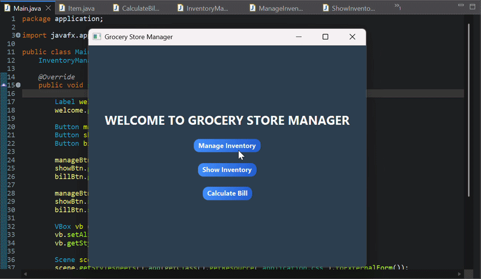

# JavaFX Grocery Store Manager

A full-featured desktop application built with JavaFX for managing store inventory, products, and sales. CSS-styled GUI with a clean, functional interface.

---

## Overview

This is a GUI-based Grocery store manager. Built entirely in Java using JavaFX for the interface and external CSS for styling.

---

## Features

- Add, update, and delete products
- Manage inventory quantities and pricing
- View all store records in a structured table
- CSS-styled interface with a consistent visual theme
- Role-based operations

---

## Tech Stack


---

## Project Structure

```
JavaFx_GroceryStoreManager/
├── src/
│   └── Storemanager/
│       ├── Main.java
│       ├── controllers/
│       └── models/
├── resources/
│   └── styles.css
└── README.md
```

---

## How to Run

1. Clone the repository
   ```bash
   git clone https://github.com/rslaanfareed/JavaFx_GroceryStoreManager.git

2. Open in Eclipse or IntelliJ
3. Make sure JavaFX SDK is configured in your build path
Run Main.java


**Muhammad Arslan Fareed** · [LinkedIn](https://www.linkedin.com/in/muhammadarslanfareed) · [GitHub](https://github.com/rslaanfareed)
